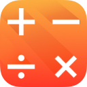

# Arithmosophi - Arithmosoϕ

[](https://gitter.im/phimage/Arithmosophi?utm_source=badge&utm_medium=badge&utm_campaign=pr-badge&utm_content=badge)
[](http://mit-license.org) [](https://developer.apple.com/resources/) [](https://developer.apple.com/swift) [](https://github.com/phimage/Arithmosophi/issues) [](http://cocoadocs.org/docsets/Arithmosophi/)

[](#logo) Arithmosophi is a set of missing protocols that simplify arithmetic on generic objects or functions.
As `Equatable` define the `==` operator , `Addable` will define the `+` operator.
```swift
protocol Addable {
    func + (lhs: Self, rhs: Self) -> Self
}
[1, 2, 3, 4].sum //  1 + 2 + 3 + 4
```
- As you might guess `Substractable` define `-` operator, `Multiplicatable` define `*` operator, etc...
- There is also some utility protocols, which combine multiple protocols into a single one : `Additive`, `ArithmeticType`, ...
- All defined in [Arithmosophi.swift](Arithmosophi.swift)

## Contents ##
- [Generic functions](#generic-functions)
- [CollectionType](#collectiontype)
- [Object attributes](#object-attributes)
- [Logical operations](#logical-operations)
- [Average](#average)
- [Complex](#complex)
- [Geometry](#geometry)
- [Setup](#setup)

## Generic functions ##
Take a look at `sumOf` function
```swift
func sumOf<T where T:Addable, T:Initializable>(input : [T]) -> T {
    return reduce(input, T()) {$0 + $1}
}
```
Array of `Int`, `Double` and even `String` could be passed as argument to this function. Any `Addable` objects.

No need to implement a function for `Double`, one for `Float`, one more for `Int`, etc...

*`sumOf` and `productOf` functions are available in [Arithmosophi.swift](Arithmosophi.swift)*


## CollectionType ##
Arithmosophi contains some useful extensions on `CollectionType`
```swift
[1, 2, 3, 4].sum //  1 + 2 + 3 + 4
[1, 2, 3, 4].product //  1 * 2 * 3 * 4

["a","b","c","d"].sum // "abcd" same as joinWithSeparator("")
[["a","b"],["c"],["d"]].sum // ["a","b","c","d"] same as flatMap{$0}
```

## Object attributes ##
The power of this simple protocols are released when using operators

If we implement a box object containing a generic `T` value
```swift
class Box<T> {
	var value: T
}
```
we can define some operators on it, in a generic way, like we can do with `Equatable` or `Comparable`
```swift
func +=<T where T:Addable> (inout box: Box<T>, addend: T) {
    box.value = box.value + addend
}
func -=<T where T:Substractable> (inout box: Box<T>, addend: T) {
    box.value = box.value - addend
}
```
how to use this operator:
```swift
var myInt: Box<Int>(5)
myInt += 37
```

For a full example, see [Prephirence](https://github.com/phimage/Prephirences/blob/master/Prephirences/Preference.swift) file from [Prephirences](https://github.com/phimage/Prephirences) framework, or sample [Box.swift](Samples/Box.swift)

### Optional trick ###
For optional attribute you can use `Initializable` or any protocol which define a way to get a value
```swift
class Box<T> {
	var value: T?
}
func +=<T where T:Addable, T:Initializable> (inout box: Box<T>, addend: T) {
    box.value = (box.value ?? T()) + addend
}
```

## Logical operations  ##
[`LogicalOperationsType`](LogicalOperationsType.swift) is a missing protocol for `Bool` inspired from `BitwiseOperationsType` (or `IntegerArithmeticType`)

The purpose is the same, implement functions without knowing the base type

You can for instance implement your own [`Boolean` enum](Samples/Boolean.swift) and implement the protocol
```swift
enum Boolean: LogicalOperationsType {case True, False}
func && (left: Boolean, @autoclosure right:  () -> Boolean) -> Boolean {
    switch left {
    case .False: return .False
    case .True:  return right()
    }
}
...
```
then create only **one** operator on `Box` for `Bool`, `Boolean` and any `LogicalOperationsType`
```swift
func &&=<T:LogicalOperationsType> (inout box: Box<T>, @autoclosure right:  () -> TT) {
    box.value = box.value && right()
}
```

Take a look at a more complex enum [Optional](Samples/Optional.swift) which implement also `LogicalOperationsType`

## Average ##
with MesosOros.swift

A type is `Averagable` if it can be dividable by an `Int` and define an operator to do that
```swift
func /(lhs: Self, rhs: Int) -> Self
```
You can conform to this protocol and `Addable` to make a custom average.

All arithmetic type conform to this protocol and you can get an average for a `CollectionType`

```swift
[1, 2, 3, 4].average //  (1 + 2 + 3 + 4) / 4
```

## Complex ##
`Complex` is a struct of two `ArithmeticType`, the real and the imaginary component

```swift
let complex = Complex(real: 12, imaginary: 9)
```
You can apply operation on it `(+, -, *, /, ++, --, -)`
```
complex + 8 // Complex(real: 20, imaginary: 9)

Complex(real: 12, imaginary: 9) + Complex(real: 8, imaginary: 1) // Complex(real: 20, imaginary: 10)
```

## Geometry ##
with `Arithmos`(number) & `Statheros`(constant)

[`Arithmos`](Arithmos.swift) and [`Statheros`](Statheros.swift) add respectively functions and  mathematical constants for `Double`, `Float` and `CGFloat`, allowing to implement generic functions without taking care of type

```swift
func distance<T: Arithmos>(#x: T, y: T) -> T {
	return x.hypot(y)
}

func radiansFromDegrees<T where T: Multiplicable, T:Dividable, T: Arithmos, T: Statheros>(degrees: T) -> T {
	return degrees * T.PI / T(180.0)
}
```

Take a look at [Geometry.swift](Samples/Geometry.swift) for more examples

## Setup
### Using [cocoapods](http://cocoapods.org/) ##
```ruby
pod 'Arithmosophi'
```
Not interested in full framework ? install a subset with:
```ruby
pod 'Arithmosophi/Core' # Arithmosophi.swift
pod 'Arithmosophi/Logical' # LogicalOperationsType.swift
pod 'Arithmosophi/Complex' # Complex.swift
pod 'Arithmosophi/MesosOros' # MesosOros.swift
pod 'Arithmosophi/Arithmos' # Arithmos.swift
pod 'Arithmosophi/Statheros' # Statheros.swift

pod 'Arithmosophi/Samples' # Samples/*.swift (not installed by default)
```

*Add `use_frameworks!` to the end of the `Podfile`.*

#### Make your own framework dependent
In podspec file
```ruby
s.dependency 'Arithmosophi'
```
or define only wanted targets
```ruby
s.dependency 'Arithmosophi/Core'
s.dependency 'Arithmosophi/Logical'
```

## Using xcode ##
Drag files to your projects
